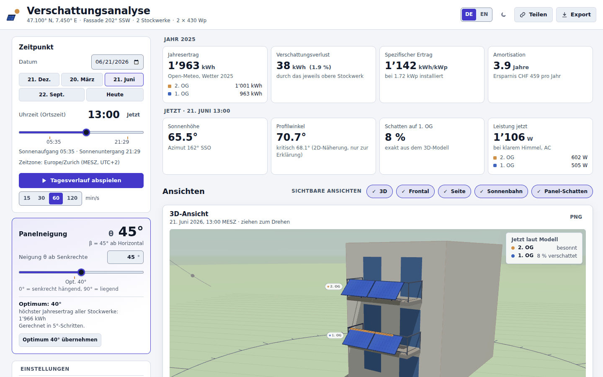
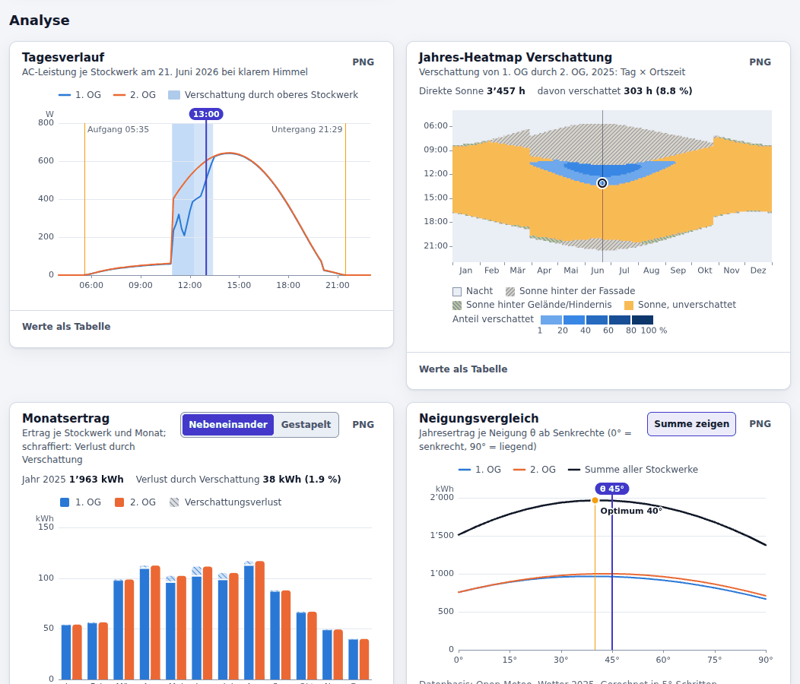

# Solar Shadow Analyzer

Verschattungsanalyse für Balkon-Solarpanels, die geneigt an übereinanderliegenden Balkongeländern hängen. Die App
berechnet exakt in 3D, wann und wie stark die Panelreihe eines Stockwerks die Reihe darunter verschattet, und
simuliert daraus den Jahresertrag je Stockwerk: mit stündlichen Wetterdaten, Geländehorizont, Hindernissen und
Wirtschaftlichkeit. Alles läuft im Browser, ohne eigenes Backend.



## Funktionen

- **Exakte 3D-Verschattung** von Panelreihe zu Panelreihe, auch der seitlich versetzte Schatten am Morgen und Abend.
  Teilverschattung je Modul wahlweise flächenanteilig oder mit 3 Bypass-Teilsträngen.
- **Fünf Ansichten**, alle relativ zur Fassadenausrichtung: 3D (drehbar, Kamera-Presets Front / Seite / Oben / Aus
  Sonnenrichtung, gerenderter Schatten plus exakter Modellschatten), Frontalansicht, Seitenansicht, Sonnenbahn und
  Panel-Schatten. Jede Ansicht lässt sich ein- und ausblenden und, wie jedes Diagramm, als PNG exportieren.
- **Zeitpunkt:** beliebiges Datum mit Schnellwahl (21. Dez., 20. März, 21. Juni, 22. Sept., Heute, Jetzt), Ortszeit
  00:00–24:00 in 5-Minuten-Schritten in der Zeitzone des Standorts, Sonnenauf- und -untergang, Tagesanimation mit
  15 / 30 / 60 / 120 simulierten Minuten pro Sekunde.
- **Panelneigung** θ 0–90° ab Senkrechte (β = 90° − θ als Zusatzinfo) mit Optimum aus dem Neigungsvergleich und
  Knopf «Optimum … übernehmen».
- **Standort:** Ortssuche, 24 Presets (14 CH, 3 AT, 7 DE), Gerätestandort, Koordinaten, Höhe und Zeitzone.
- **Gebäude und Panels:** 1–8 Stockwerke ab einem wählbaren untersten Stockwerk, Stockwerkhöhe, Geländerhöhe,
  Balkontiefe; 5 Modul-Presets, Quer- oder Hochformat, 1–8 Module nebeneinander, Modulabstand, Nennleistung.
- **System:** Wechselrichter-Grenze je Stockwerk, Systemverluste, Temperaturkoeffizient, NOCT, Albedo, Modell der
  Teilverschattung.
- **Horizont & Umgebung:** Geländehorizont aus einem Höhenmodell (bis ca. 50 km), bis zu 20 Hindernisse
  (Nachbargebäude als Quader), eigene Horizontpunkte oder Import einer PVGIS-Horizontdatei.
- **Wetterdaten:** stündliche Open-Meteo-Daten für ein Jahr ab 1940 bis zum letzten vollständigen Jahr, oder ein
  synthetisches Jahr mit klarem Himmel (als theoretisches Maximum gekennzeichnet).
- **Ergebnisse:** Kennzahlen (Jahresertrag, Verschattungsverlust, spezifischer Ertrag, Amortisation, Werte zum
  gewählten Zeitpunkt), Tagesverlauf, Jahres-Heatmap der Verschattung, Monatsertrag, Neigungsvergleich 0–90° in
  5°-Schritten, Wirtschaftlichkeit und Monatstabelle.
- **Teilen und Export:** Teilen-Link (`#c=…`), Konfiguration als JSON speichern und laden, CSV (Monatsertrag je
  Stockwerk, Neigungsvergleich, Heatmap), PNG je Ansicht und Diagramm, Druckbericht (auch als PDF). Einstellungen bleiben im
  Browser gespeichert.
- **Oberfläche:** Deutsch und Englisch, dunkles und helles Design. Ab 1100 px Breite stehen die Eingaben in einer
  Seitenleiste; schmaler ist die Seite einspaltig, mit den Ergebnissen vor den Einstellungen (ausgelegt ab 320 px
  Breite, automatisch getestet bei 360 px).
- **Handy und Touch:** Auf Handys und Tablets mit Touchscreen folgt die 3D-Ansicht direkt auf die Kennzahlen, und
  eine Steuerleiste am unteren Bildschirmrand hält Uhrzeit, Tagesanimation und Panelneigung in Reichweite und
  springt zu jedem Bereich der Seite. Bedienelemente sind dort mindestens 44 px gross, und wer über einen Regler,
  den Kompass oder ein Diagramm scrollt, verstellt nichts.



## Online nutzen & aufs Handy installieren

Die App läuft ohne Installation im Browser: **<https://cyclodex.github.io/solar-shadow-analyzer/>**

Sie lässt sich auch wie eine App installieren, auf dem Handy, dem Tablet oder dem Computer:

- **Android (Chrome, Edge, Samsung Internet) und Chrome oder Edge am Computer:** Knopf «Installieren» oben rechts
  (auf schmalen Bildschirmen nur das Symbol mit dem Pfeil) oder im Browsermenü «App installieren».
- **iPhone und iPad (Safari):** «Teilen» antippen (bei neueren iOS-Versionen zuerst «…» neben der Adresszeile,
  dann «Teilen»), «Zu Home-Bildschirm hinzufügen» wählen, «Als Web-App öffnen» eingeschaltet lassen (falls
  angezeigt) und mit «Hinzufügen» bestätigen. Der Knopf «Installieren» zeigt diese Schritte ebenfalls.

**Auf dem Handy** (und auf Tablets mit Touchscreen) liegt am unteren Bildschirmrand eine Steuerleiste: − und +
verschieben die Uhrzeit um 15 Minuten, ein Tipp auf die Uhrzeit öffnet den Zeitregler, daneben startet und stoppt
der Abspielknopf die Tagesanimation, θ öffnet den Neigungsregler (mit dem Optimum als Marke), und «Springe zu» führt
zu Ergebnissen, Ansichten (3D), Zeitpunkt und Neigung, Analyse oder Einstellungen; der Teilen-Link in der
Adresszeile bleibt dabei erhalten. Regler, Fassadenkompass und Diagramme reagieren auf einen Tipp oder auf
seitliches Ziehen, senkrechtes Wischen scrollt nur die Seite. Im Neigungsvergleich zeigt ein Tipp die Werte einer
Neigung; übernommen wird sie erst mit dem Knopf «Neigung … übernehmen». Auf einer langsamen Verbindung erscheinen
Jahreswerte und optimale Neigung zuerst mit dem Hinweis «vorläufig – Geländehorizont wird geladen», bis die rund
2 MB Höhenkacheln für den Geländehorizont da sind.

Nach dem ersten Besuch startet die App auch ohne Internet, installiert oder im Browser: Alle App-Dateien liegen dann
im Browser. Wetterdaten und Geländehorizont für einen neuen Standort oder ein anderes Jahr brauchen eine Verbindung;
einmal geladene bleiben gespeichert, ohne Verbindung rechnet die App sonst mit klarem Himmel und ohne Gelände. Im
Safari-Browser auf iPhone und iPad löscht iOS diese Daten samt den gespeicherten Einstellungen, wenn Safari sieben
Tage lang benutzt, die Seite dabei aber nicht besucht wurde; als Home-Bildschirm-App bleiben sie erhalten
([WebKit](https://webkit.org/blog/10218/full-third-party-cookie-blocking-and-more/)). Ist eine neue Version
veröffentlicht, meldet die App «Neue Version verfügbar»: «Neu laden» wechselt sofort, «Später» behält die laufende
Version, bis alle Fenster der App geschlossen sind oder in einem anderen Fenster «Neu laden» gewählt wird (dann laden
alle Fenster neu).

Veröffentlicht wird automatisch: Nach einem Push auf `main` baut `.github/workflows/pages.yml` die App und stellt sie
auf GitHub Pages, sobald die CI (Lint, Tests, Build, E2E) für diesen Commit erfolgreich war; manuell gestartet
veröffentlicht der Workflow den aktuellen Stand von `main` ohne CI. Einmalig vor dem ersten Deployment im Repository
unter **Settings → Pages** als **Source** «GitHub Actions» wählen.

## Schnellstart

Voraussetzung: Node.js 22.22.2 oder neuer (22.x), 24.15 oder neuer (24.x) oder ≥ 26, wie `engines` in
`package.json`: die Versionen, die jsdom, Vitest, Vite und ESLint unterstützen. `.nvmrc` wählt die neueste
22.x (z. B. `nvm use`).

```bash
git clone https://github.com/Cyclodex/solar-shadow-analyzer.git
cd solar-shadow-analyzer
npm ci
npm run dev   # http://localhost:5173
```

## Skripte

| Befehl                     | Zweck                                                                  |
| -------------------------- | ---------------------------------------------------------------------- |
| `npm run dev`              | Entwicklungsserver (Vite)                                              |
| `npm run build`            | Typecheck (`tsc -b`) und Produktions-Build nach `dist/`                |
| `npm run preview`          | Build lokal ausliefern                                                 |
| `npm test`                 | Unit- und Komponententests (Vitest: `model` in Node, `ui` in jsdom)    |
| `npm run test:watch`       | Vitest im Watch-Modus                                                  |
| `npm run typecheck`        | TypeScript-Prüfung (`tsc -b`)                                          |
| `npm run lint`             | ESLint                                                                 |
| `npm run format`           | Prettier: alle Dateien formatieren                                     |
| `npm run format:check`     | Prettier: Formatierung prüfen                                          |
| `npm run e2e`              | End-to-End-Tests mit Playwright (Chromium) gegen den Produktions-Build |
| `npm run icons`            | App-Icons (PNG) aus `public/favicon.svg` erzeugen                      |
| `npm run validate:terrain` | Geländehorizont gegen PVGIS `printhorizon` prüfen (braucht Netzwerk)   |
| `npm run validate:yield`   | Jahresertrag gegen PVGIS prüfen (braucht Netzwerk)                     |

### Tests und CI

- `npm run e2e` baut die App und startet `vite preview` auf Port 4173 (anpassbar mit `E2E_PORT`). Einmalig vorher
  `npx playwright install chromium` ausführen; mit `PLAYWRIGHT_CHROMIUM_PATH` lässt sich ein anderes Chromium
  verwenden. Die Tests blockieren alle externen Dienste und prüfen u. a. die 3D-Darstellung (WebGL über SwiftShader),
  den Teilen-Link, die Sprachumschaltung, das Layout bei 360 px, die Steuerleiste auf einem iPhone 14, die
  Kameraleiste auf einem iPhone SE, Manifest und Icons sowie den Offline-Start über den Service Worker.
- Die App lässt sich unter einem Unterpfad bauen: `BASE_PATH=/solar-shadow-analyzer/ npm run build` wie für GitHub
  Pages (dort kommt der Pfad aus `actions/configure-pages`). Mit derselben Variable laufen auch die E2E-Tests unter diesem Pfad, z. B.
  `BASE_PATH=/solar-shadow-analyzer/ E2E_PORT=4811 npm run e2e`.
- `npm run validate:terrain` lädt Höhenkacheln und PVGIS-Horizonte, `npm run validate:yield` Open-Meteo-Wetter und
  PVGIS-Ertragsreihen. Hinter einem HTTP-Proxy braucht Node `NODE_USE_ENV_PROXY=1`; die Optionen stehen im Kopf von
  `scripts/validate-terrain.ts` und `scripts/validate-yield.ts`.
- Die CI (GitHub Actions, Node aus `.nvmrc`) führt Lint, `format:check`, Typecheck, Tests und Build aus und danach die
  E2E-Tests, einmal unter `/` und einmal unter `/solar-shadow-analyzer/`. Nach einer erfolgreichen CI für einen Push
  auf `main` veröffentlicht `.github/workflows/pages.yml` die App auf GitHub Pages.

## Standardwerte

Die Werte stammen aus `DEFAULT_CONFIG` in [`src/model/defaults.ts`](src/model/defaults.ts); die zulässigen Bereiche
stehen dort in `LIMITS`.

- **Standort:** 47.1° N / 7.45° E, 486 m ü. M., Zeitzone Europe/Zurich.
- **Gebäude:** Fassadenazimut 202° (SSW); 2 Stockwerke mit Panels ab dem 1. OG; Stockwerkhöhe 280 cm, Geländerhöhe
  100 cm, Balkontiefe 150 cm.
- **Panels:** 2 Module à 430 Wp nebeneinander im Querformat, Breite entlang des Geländers 176.2 cm, Länge entlang
  der Neigung 113.4 cm, Abstand 2 cm; Neigung θ = 45° ab Senkrechte (β = 45°).
- **System:** Wechselrichter-Grenze 800 W je Stockwerk, Systemverluste 14 %, Temperaturkoeffizient −0.35 %/K,
  NOCT 45 °C, Albedo 0.2, Teilverschattung mit Bypass-Teilsträngen.
- **Horizont:** Geländehorizont an, keine Hindernisse, keine eigenen Horizontpunkte.
- **Wetterdaten:** Open-Meteo, Jahr 2025.
- **Wirtschaftlichkeit (Beispielwerte):** CHF, Strompreis 0.30/kWh, Einspeisevergütung 0.08/kWh, Eigenverbrauch
  70 %, Investition 900 je Stockwerk, Degradation 0.5 %/Jahr, Betrachtungsdauer 25 Jahre.

## Modell und Validierung

- **Sonnenstand** nach NOAA inkl. Refraktion: höchstens 0.02° Abweichung zu astronomy-engine (20 000 Zeitpunkte
  1970–2070), zusätzlich der Referenzfall des NREL-SPA als Test.
- **Verschattung:** Die Reihe darüber wirft ihren Schatten als Verschiebung auf die parallele Panelebene darunter;
  das Schattenrechteck wird exakt mit den Modulen geschnitten und gegen Brute-Force-Ray-Casting getestet.
- **Energie:** Direktstrahlung mit Einfallswinkelverlust (ASHRAE), isotrope Diffusstrahlung mit Himmelssichtfaktor
  je Stockwerk, Bodenreflexion, Modultemperatur nach NOCT, Systemverluste und AC-Grenze je Stockwerk.
  Im Vergleich mit PVGIS 5.3 (Bern, freistehend, 1 kWp, 14 % Verluste, ohne Horizont; β = 35° Süd, 45° und 90° bei
  202°; Wetter 2020–2023; `npm run validate:yield`): mit Open-Meteo `era5` −0.7 % bis −1.3 % zu PVGIS-ERA5 derselben
  Jahre; mit der Standardauswahl `best_match` +1.4 % bis +2.9 % zu PVGIS-SARAH3 derselben Jahre und +4.3 % bis
  +5.3 % zum SARAH3-Mittel 2005–2023.
- **Geländehorizont:** AWS-Terrarium-Kacheln, 1°-Raster bis ca. 50 km, mit Erdkrümmung und Refraktion, je
  Stockwerk ab der Oberkante der Panelreihe, im Hintergrund (Web Worker) gerechnet. Gegenüber
  PVGIS `printhorizon` RMS 0.34° (Mittelland), 1.19° (Grindelwald) und 1.22° (Zermatt).

Formeln, Koordinatensysteme, Konventionen und Modulgrenzen: [docs/ARCHITECTURE.md](docs/ARCHITECTURE.md).

## Datenquellen und Datenschutz

Die App hat kein eigenes Backend. Die Seite selbst liefert GitHub Pages aus; dabei wird laut GitHub die IP-Adresse
der Besucherinnen und Besucher aus Sicherheitsgründen protokolliert
([GitHub Docs](https://docs.github.com/en/pages/getting-started-with-github-pages/what-is-github-pages)). Die App
ruft direkt aus dem Browser folgende Dienste auf:

- **Open-Meteo Historical Weather API** (`archive-api.open-meteo.com`): erhält die auf 0.01° gerundeten Koordinaten
  und das Jahr, automatisch bei der Wetterquelle Open-Meteo (Standard). Daten unter
  [CC BY 4.0](https://creativecommons.org/licenses/by/4.0/), «Weather data by Open-Meteo.com».
- **Open-Meteo Geocoding API** (`geocoding-api.open-meteo.com`): erhält den Suchtext, nur bei einer Ortssuche. Ortsdaten
  von GeoNames (CC BY 4.0).
- **swisstopo / geo.admin.ch** (nur für die Schweiz und Liechtenstein; freie Geodaten, «© swisstopo»,
  [Nutzungsbedingungen](https://www.swisstopo.admin.ch/de/nutzungsbedingungen-kostenlose-geodaten-und-geodienste)):
  - Adresssuche (`api3.geo.admin.ch`): erhält den Suchtext bei einer Adresssuche; nach der Wahl einer Adresse die
    Gebäudeangaben aus dem Gebäude- und Wohnungsregister (Geschosse, Baujahr) und die Höhe am Standort (Koordinaten).
  - Gebäude der Basiskarte (`vectortiles.geo.admin.ch`): Kartenkacheln rund um den Standort (etwa 0.2–0.7 MB),
    nach der Wahl einer Adresse und bei einem Import der Gebäude.
  - Oberflächenmodell swissSURFACE3D und Geländemodell swissALTI3D (`data.geo.admin.ch`): Ausschnitte rund um den
    Standort (etwa 5–9 MB bei 300 m Umkreis), nur mit eingeschalteter Laserscan-Umgebung.
- **Terrain Tiles** (AWS Open Data, `s3.amazonaws.com/elevation-tiles-prod`): Höhenkacheln rund um den Standort,
  automatisch bei eingeschaltetem Geländehorizont (Standard). Quellen und Namensnennung:
  [Tilezen/Mapzen](https://github.com/tilezen/joerd/blob/master/docs/attribution.md), u. a. SRTM, GMTED2010, ETOPO1
  und EU-DEM (produced using Copernicus data and information funded by the European Union).
- **PVGIS** wird nicht automatisch abgefragt (keine CORS-Freigabe): Die App verlinkt nur den Horizont für den
  Standort, die heruntergeladene Datei kann importiert werden.

Der Gerätestandort wird nur auf Klick über die Geolocation-API des Browsers abgefragt. Konfiguration (inkl.
Koordinaten), UI-Einstellungen und zwischengespeicherte Wetter- und Geländedaten liegen im `localStorage`, die
App-Dateien für den Offline-Start im Cache des Service Workers (nur Dateien der App selbst). Wird die Seite verlassen,
bevor der URL-Hash nachgeführt ist, übergibt der `sessionStorage` (`ssa.pendingHash`) ihn dem nächsten Aufruf im
selben Tab; dort merkt sich die App auch, wann sie sich wegen einer neuen Version selbst neu geladen hat
(`ssa.chunkReload`). Der Teilen-Link trägt die Konfiguration im URL-Hash: Dieser wird an keinen Server gesendet. **Wer
den Link erhält, sieht den genauen Standort** (Koordinaten auf etwa 10 cm, nach einer Adresssuche auch die Adresse als
Bezeichnung) und die gespeicherten Nachbargebäude. Der Sonnenstand wird lokal berechnet.

## Einschränkungen

- Nur die Panelreihe des direkt darüberliegenden Stockwerks wirft Schatten. Höhere Stockwerke könnten nur durch
  Lücken zwischen Modulen zusätzlich schatten; der Effekt liegt unter 0.01 Prozentpunkten des Jahresertrags.
- Gelände und Hindernisse wirken als Horizont: das Gelände ab der Oberkante der Panelreihe (auf 1 m gerundet), die
  Hindernisse gesehen von der Panelmitte jedes Stockwerks. Die Direktstrahlung ist dann für die ganze Reihe da oder
  nicht, ohne Teilschatten einzelner Module durch Hindernisse.
- Isotropes Diffusmodell, ohne zirkumsolare Aufhellung und ohne Horizontaufhellung.
- Seitenwände und Nachbarbalkone werden nicht modelliert; die Balkonplatte liegt hinter der Panelebene und
  schattet nicht.
- Wetterdaten eines einzelnen Jahres aus der Open-Meteo Historical Weather API (Modellauswahl `best_match`), kein
  langjähriges Mittel; das Jahr mit klarem Himmel ist eine Obergrenze.
- Der Geländehorizont hängt von der Auflösung der Höhenkacheln ab. Lassen sich die Kacheln nicht laden, rechnet die
  App ohne Gelände und zeigt einen Hinweis.
- Laserscan-Umgebung und Gebäude-Import gibt es nur in der Schweiz und in Liechtenstein (swisstopo). Bäume gelten
  ganzjährig als undurchsichtig; Nachbargebäude als Grundriss mit flachem Dach überschätzen Schrägdächer.
- Wirtschaftlichkeit mit konstanten Preisen, ohne Diskontierung und ohne laufende Kosten.
- Modellrechnung ohne Gewähr: Sie ersetzt keine Fachplanung.

## Stack

React 19 · TypeScript 6 · Vite 8 · zustand 5 · three.js 0.186 mit @react-three/fiber 9 und drei 10 (nur die 3D-Ansicht,
lazy geladen) · fast-png in einem Web Worker für den Geländehorizont · @mapbox/vector-tile und pbf für die
swisstopo-Gebäude · CSS Modules mit CSS-Variablen · SVG- und Canvas-Diagramme ohne Chart-Library · vite-plugin-pwa
(Workbox) für Installation und Offline-Start · Vitest 5, Testing Library, Playwright, ESLint 10, Prettier 3.

## Weiterentwicklung

Stand und offene Punkte: [PLAN.md](PLAN.md). Architektur und Konventionen für Beiträge:
[docs/ARCHITECTURE.md](docs/ARCHITECTURE.md).

## Lizenz

[MIT](LICENSE) © 2026 Fabian Gander. Daten externer Dienste stehen unter deren eigenen Lizenzen (siehe
[Datenquellen und Datenschutz](#datenquellen-und-datenschutz)).
